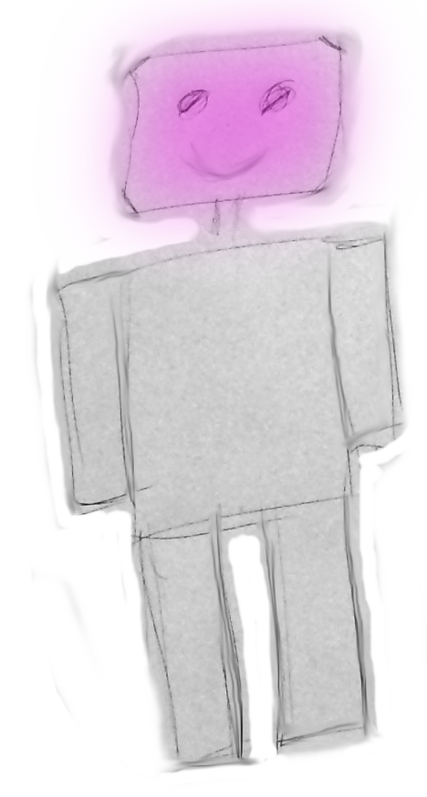
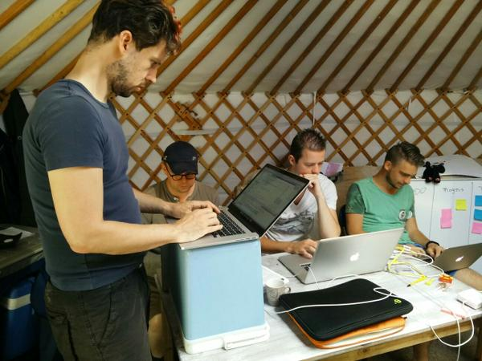

# Day Three

<small>Thursday, August 27th 2015</small>

## Introduction

After the breakfast and daily cross-team standup we moved to a smaller tent.
It was announced to us that rain would be forthcoming for most of the day.
Because we had a different table, I created a new setup, as a standing desk and
[Mitchel] set up the [Arduino] _inside_ a box, to make sure it couldn't get wet.

## Getting out of the rain

Pretty soon after we got settled, the rain came drizzling down and didn't really
stop for most of the day.

To get a better feeling of where we were at in our plan (and to see how far we
still had to go), we held a short standup.

To keep an eye on what we were doing we decided it might be a good idea to set
up a scrum or kanban board. Because we felt there was a large likelihood of our
team moving locations at a later time a digital board seemed more useful.

I suggested using [a waffle board for our project].

Another part of the discussion was on how we could possibly improve the Arduino
coding cycle, as it was quite slow-going. [Jerry] suggested that an emulator
might be available, so code could be checked before sending it to the Arduino.
Eventually we decided that it may be counter-productive to look into that, but
to look into that at a later date (after WeCamp).

## Getting things done

Despite the rain, we set to work enthusiastically. Unfortunately, there were
some setbacks with the Arduino. One was understanding how the [Arduino serial
console] worked. The main issue was making sure that the frequency set from the
code and used in the console were the same.

Another thing that impeded on our progress was understanding the different
layers that make up the Arduino software stack. The fact that various examples
(either from the aRest library, the Arduino website itself or elsewhere online)
used different layers. This send us on a bit of a [wild goose chase] through the
C/C++ reference, the [AVR libc] and [Arduino manual].

After some time of successful coding [Mitchel] ran into another problem. After
some people jumping in to help, the cause was found to be the fact that the end
of strings are marked with a NULL character. This meant the counting logic was of-by-one.

While all of this was going on, Jerry] made great headway with his plugin
architecture and the plugin to communicate with Slack and I had set up the
ground work for the plugin that handled comunication with the Arduino.

We also managed to create a digital version of the sketch for our bot from the
day before:

## Getting out of the cold

The longer the rain lasted, the colder it got in the tent, especially because
one side was open. The TalkBack team was graceful enough to allow us to share
their yurd. Supported by our coach, we moved our workstation to their tent.
And there was much rejoicing.

## Almost getting there

After yet another lovely dinner I had several rather lengthy conversations with
different people after which we did some more work. Before heading of to bed, all
of the individual components were finished. All that was needed to have a
minimum viable product was to integrate the individual components.

[Arduino]: https://www.arduino.cc
[Arduino manual]: https://www.arduino.cc/en/Reference/
[Mitchel]: https://twitter.com/MVerschoof
[Jerry]: https://twitter.com/getfocusnl
[Richard]: https://twitter.com/Richard_Tuin

[a waffle board for our project]: https://waffle.io/WeCamp/ardo
[Arduino serial console]: https://www.arduino.cc/en/Reference/Serial
[AVR libc]: http://www.nongnu.org/avr-libc/user-manual/index.html
[wild goose chase]: https://en.wiktionary.org/wiki/wild-goose_chase
