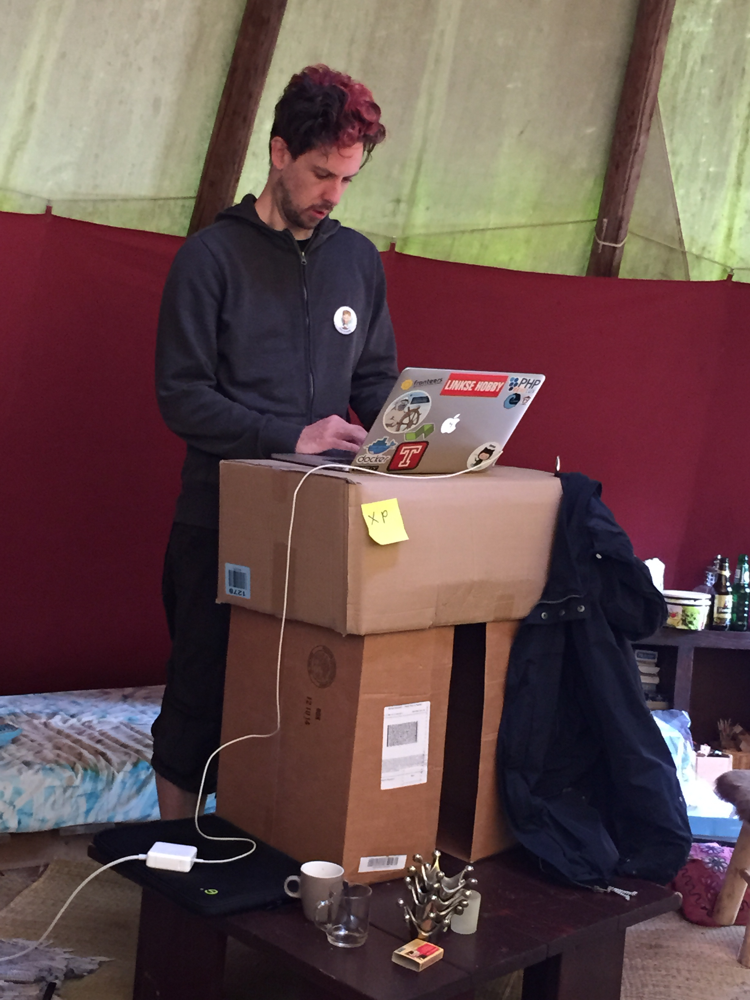
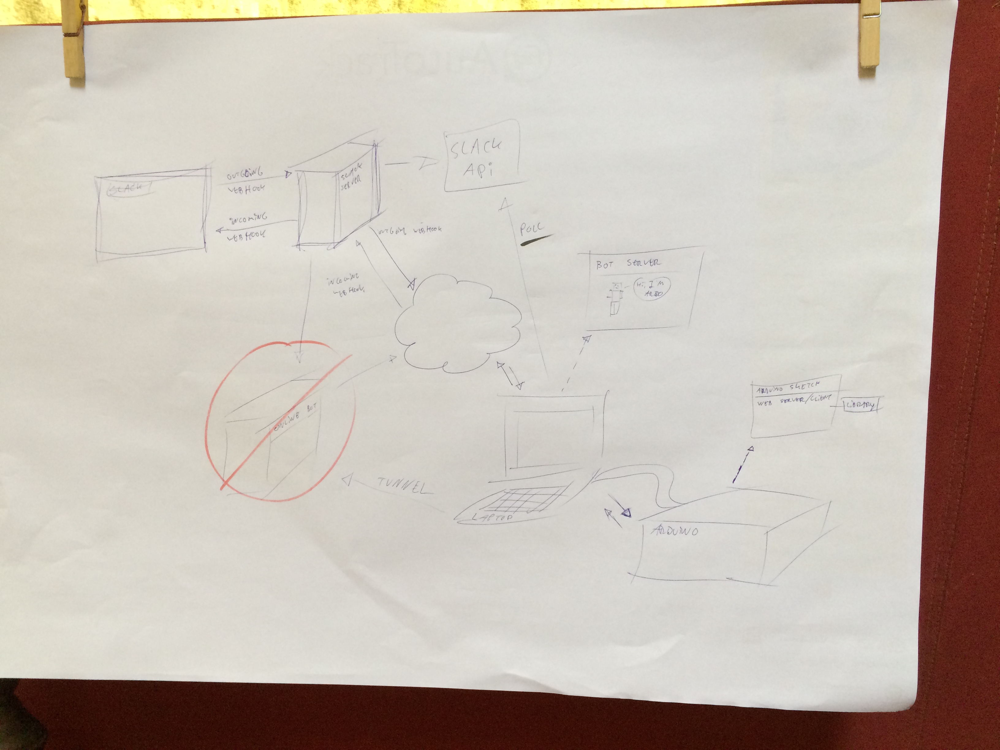
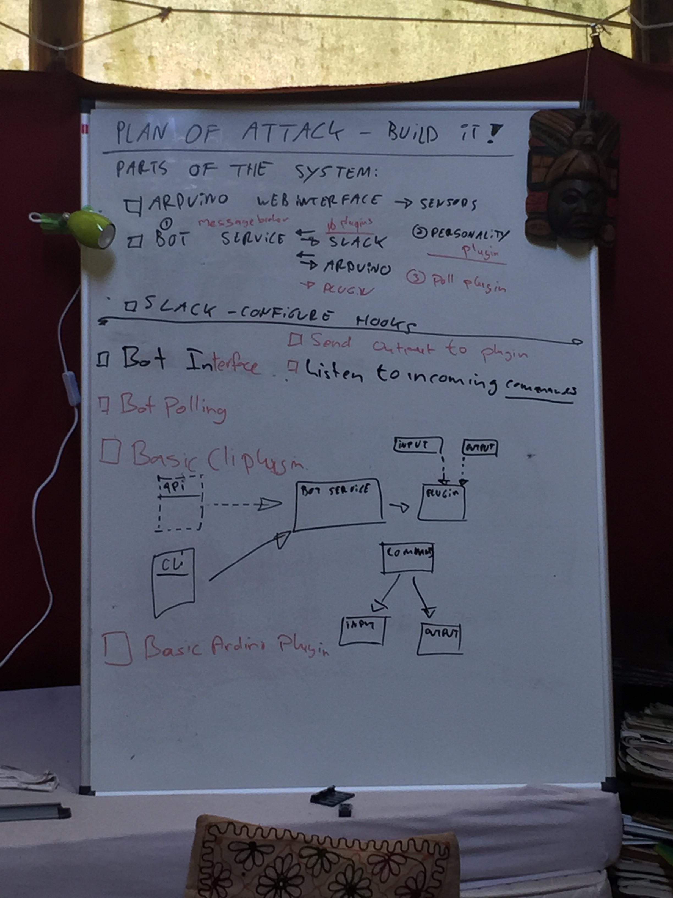

# Day Two

## Introduction

After sleeping quite well, day two arived. After having breakfast and a daily
"all hands on deck" standup, we got to work. The first thing I did, was create a desk
to stand at. I even [gained some XP](https://twitter.com/shochdoerfer/status/636475360855654400)
for it.

## A storm of brains

The day before, we reached the "rethink" stage. So we set to brainstroming,
again.

During this phase [I made some drawings](https://twitter.com/Richard_Tuin/status/636480721612341248/)
to help visualize our plans and design.

During the design session I mentioned a technique from Alistair Cockburns book
_Writing effective use cases_

It basically outlines how people need to be more aware of the level they are on
when discussion any topic. It also tries to help developers avoid diving into
detail too much (or too soon).

With this in mind, after having talked our way through the minefield otherwise
known as "aplication architecture" we came up with what (and partly how) we
needed to build.

At this point we decided to postpone building things until after a break, which
involved a (mostly wasp free) lunch.

## Doing a rain dance

After the break we went to find a new location to actually write code. In part
this was to have a change of scenery and in part to have a difference in spaces
in which we either design or program.

Despite the news that rain might be forthcoming we decided to sit outside and
code there. Worst case scenario, we would have to work a bit harder to get things
done before the rain came.

While [Jerry] started working on the Bot part, [Mitchel] and I started on the
[Arduino] part.

We connected the piezo speaker to the Arduino, ran the "play a sound" example,
ran the "connect through HTTP" example and ran the aRest Ethernet example.

- The [aRest Ethernet example](https://raw.githubusercontent.com/marcoschwartz/aREST/master/examples/Ethernet/Ethernet.ino)
- The [breadboard layout sheet](http://ardx.org/src/circ/CIRC01-sheet-OOML.pdf) and [manual page](http://www.oomlout.com/oom.php/products/ardx/circ-06) for the speaker

Some of the things that formed our learning experience were how the
save/compile/upload mechanism works. Another thing that made it a lot more
pleasant to go through the edit/upload/run cycle were the keyboard shortcuts:

- <kbd>⌘</kbd>+<kbd>S</kbd> to save (as is usually the case)
- <kbd>⌘</kbd>+<kbd>R</kbd> to compile the code
- <kbd>⌘</kbd>+<kbd>U</kbd> to upload the code to the Arduino

## And then it didn't rain

The sun was shining, the wasps were leaving us alone and everyting worked.
Things were looking good. So we tried combining the sound and aRest example to
have the Arduino play a sound through the REST API.

...and everything fell to pieces.

The sound was triggered but the melody got cut off half way through and after
that new versions would no longer upload. Unplugging and re-trying (or uploading
another sketch) gave mixed result but all in all... Nothing really worked.

After some searching, poking around and F5 driven debugging, the problem became
more apparent. As the aRest example we used was meant to trigger a light it had
a line utilizing the [watchdog timer](http://www.practicalarduino.com/pics/wdt-block-diagram-small.jpg).

    // Start watchdog
    wdt_enable(WDTO_4S);

In some way, this was messing with the timing involved in the playing of the
sound and the uploading of the code. This lead to several possible solutions
that could be implementated at a later time.

## Breaking things up

After this, the threat of rain seemed to become more prominent so we broke up the
outside effort.

After moving inside [Jerry] continued working on his end of things, I did some
more researching on the watchdog ...and then there was dinner. Which was
excellent. _@TODO: Add more [expletives](https://www.google.co.uk/search?q=expletive)
to describe how tasty diner was_

[Mitchel]: https://twitter.com/MVerschoof
[Jerry]: https://twitter.com/getfocusnl
[Arduino]: https://www.arduino.cc
[Richard]: https://twitter.com/Richard_Tuin
